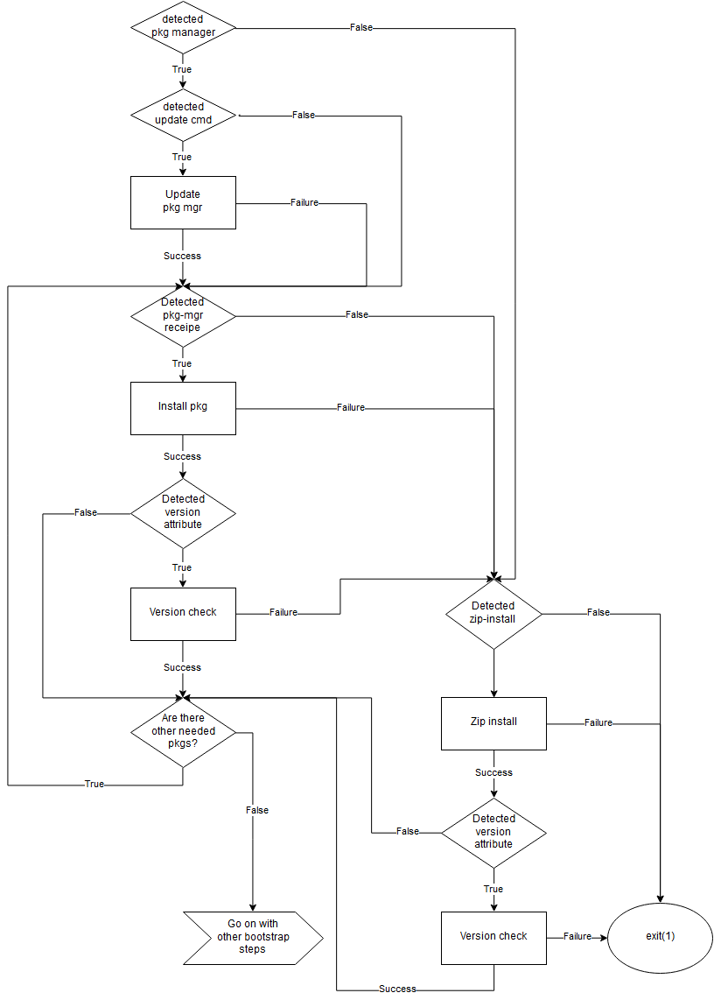

# MAIN PURPOSE

This project aims to be an universal bootstrap script written in python.
It's main purposes are two:

1. automatically install dependecies, configure meson and build the project on a freshly installed machine (no matter which OS, architecture, ecc...) for CI purposes.
2. Leverage the project contributors form the attention on dependencies and build. Who wants to hack with the code or contribute should just run bootstrap.py in order to have the project built and tests run.

## The "infrastructure" will be as follow
+ `bootstrap.py` located in bootstrap repo
+ `bootstrap-db.yml` located in bootstrap repo (holds data of surveyed platforms, pkg managers, pkg names, linux distributions, etc.)
+ `bootstrap-config.yml` located in project's repo and holds config values that can be hacked a little by the local user

## Therefore the main steps are the following

+ Install dependecies
    1. Detect system's platform (we will use sys.platform). Examples are:
        + linux
        + darwin
        + win32
        + sunos
        + freebsd
    2. Based on detected platform, try to detect the OS (linux distro, Windows version, etc.)
        + Debian
        + Ubuntu
        + Red Hat
        + Fedora
        + CentOS
        + Windows 7, 8, 10
    3. Based on detected platform and/or detected OS determine which package manager to use.
        + brew
        + port
        + apt-get
        + dnf
    4. Based on the data gathered above and `bootstrap-config.yml` file, determine which packages are needed and install them.
    This point is little bit arbitrary because I associated *"pkg manager with pkg names"* when the real association is between *"pkg name and source repo as configured in the pkg manager"*. Anyway, as stated in the "Main purpose" section our goal is build on many freshly installed systems where the source repository and pkg manager are the standard ones shipped with the OS, so actually I could also associate OS and pkg names directly with the OS but I assume that one can change pkg manager on his own system, so I relay on this association: *"pkg manager - pkg name"*. If someone tweaked his system much then this should be able to modify also bootstrap accordingly.
    The actions required are more or less these:
        + build an array of pkg names, receipes (pkg manager and zip install), version; Here we are referring to system pkgs, not python pkgs, then install pkgs (following flow chart).
        
        
        
        + build an array of pip-3 pkgs and related version.
        
            
        
+ Configure Meson
+ Run tests

